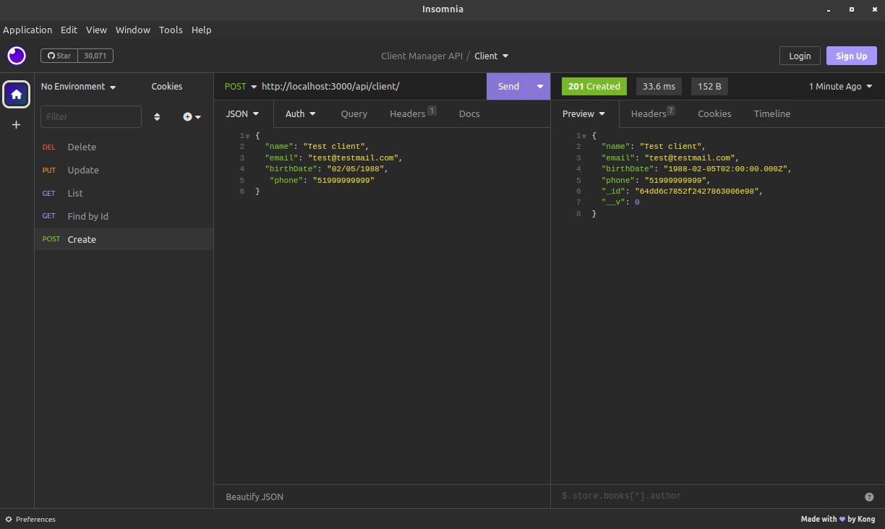

# ClientManagerAPI
NodeJs with Express API that exposes end-points for manage clients. The goal of this project is practice and consolidate all the aspects of a CRUD implementation in NodeJs with Express and MongoDB.

